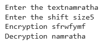

## Caesar Cipher

### Overview

The Caesar Cipher is one of the simplest and oldest methods of encrypting messages, named after Julius Caesar, who reportedly used it to protect his military communications.

### How It Works

1. Choose a shift value (key) between 1-25.
2. For each letter in the plaintext:
   - Shift it forward in the alphabet by the key value.
   - If you reach the end of the alphabet, wrap around to the beginning.
3. Numbers and special characters typically remain unchanged.

**Example with shift of 3:**

- Plaintext: `HELLO`
- Ciphertext: `KHOOR`

### Why It's Used

- **Educational purposes** - teaching basic cryptography concepts.
- **Simple implementation**.
- **Historical significance**.
- **Quick manual encryption** when sophisticated methods aren't available.

### Advantages

- Very easy to understand and implement.
- No special tools needed for manual encryption/decryption.
- Quick to perform with small messages.
- Perfect for teaching basic cryptography concepts.

### Disadvantages

- Extremely vulnerable to brute force attacks (only 25 possible keys).
- Susceptible to frequency analysis.
- Maintains letter frequency patterns.
- No security for modern applications.
- Single key for the entire message makes it predictable.

### Security Considerations

This cipher is not secure for modern use because:

- There are only 25 possible keys to try.
- Letter frequency analysis can easily break it.
- Patterns in the original text remain visible in the encrypted text.

## Screenshot of implementation and Output

