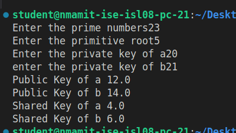

# Diffie-Hellman Key Exchange Algorithm

## Overview

A Python implementation of the Diffie-Hellman key exchange algorithm, demonstrating secure key sharing between two parties over an insecure channel.

## Features

- Prime number-based calculations
- Primitive root validation
- Private key generation
- Public key exchange
- Shared secret key computation

## Mathematical Foundation

- **Public Key Generation**: Y = (a^X) mod p
- **Shared Secret Calculation**: K = (Y^X) mod p

Where:

- p = Prime number
- a = Primitive root
- X = Private key
- Y = Public key
- K = Shared secret key

## Usage

```python
python diffie_hellman.py
```

### Sample Input/Output

```
Enter the prime number: 23
Enter the primitive root: 5
Enter the private key of a: 6
Enter the private key of b: 15

Public Key of a: 8
Public Key of b: 19
Shared Key of a: 2
Shared Key of b: 2
```

## Implementation Details

### Key Generation Process

1. **Parameters**:

   - Select prime number (p)
   - Choose primitive root (a)
   - Generate private keys (Xa, Xb)

2. **Public Key Calculation**:

   ```python
   Ya = (a^Xa) mod p  # Alice's public key
   Yb = (a^Xb) mod p  # Bob's public key
   ```

3. **Shared Secret Generation**:
   ```python
   Ka = (Yb^Xa) mod p  # Alice's calculation
   Kb = (Ya^Xb) mod p  # Bob's calculation
   ```

## Security Considerations

### Strengths

- No need to share secret keys
- Forward secrecy
- Man-in-the-middle attack resistant (with authentication)

### Recommendations

- Use large prime numbers
- Verify primitive root properties
- Implement proper key validation
- Add authentication mechanism

## Requirements

- Python 3.x
- Math module (built-in)

## Running the Program

```bash
cd "Lab programs/Lab8_Diffie Hellman"
python diffie_hellman.py
```

## Limitations

- Basic implementation for educational purposes
- No input validation
- No error handling
- Not suitable for production use

## Example Use Case

```python
# Parameters
p = 23    # Prime number
a = 5     # Primitive root
Xa = 6    # Alice's private key
Xb = 15   # Bob's private key

# Result
# Both parties will arrive at the same shared secret (2)
```

## Contributing

1. Fork the repository
2. Create a feature branch
3. Submit pull request

## References

1. Original Diffie-Hellman paper: "New Directions in Cryptography"
2. NIST SP 800-56A: Recommendation for Pair-Wise Key Establishment Schemes
3. RFC 3526: More Modular Exponential (MODP) Diffie-Hellman groups

## Screenshot of implementation and Output


