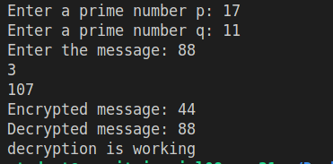

# RSA (Rivest-Shamir-Adleman) Algorithm Implementation

## Overview

A simple implementation of the RSA cryptographic algorithm in Python. This program demonstrates the basic principles of RSA including key generation, encryption, and decryption.

## Features

- Prime number-based key generation
- Public and private key pair creation
- Message encryption and decryption
- GCD calculation for key generation
- Modular arithmetic operations

## Mathematical Foundation

### Key Generation

1. Choose two prime numbers p and q
2. Calculate n = p × q
3. Calculate φ(n) = (p-1) × (q-1)
4. Find e where 1 < e < φ(n) and gcd(e, φ(n)) = 1
5. Calculate d where d × e ≡ 1 (mod φ(n))

### Encryption/Decryption

- Encryption: C = M^e mod n
- Decryption: M = C^d mod n

## Usage

```python
# Example usage
p = 17    # First prime number
q = 11    # Second prime number
message = 88    # Message to encrypt

# Run the program
python rsa.py
```

## Sample Output

```
Enter a prime number p: 17
Enter a prime number q: 11
Enter the message: 88
e = 7
d = 23
Encrypted message: 11
Decrypted message: 88
decryption is working
```

## Functions

### `gcd(a, b)`

- **Purpose**: Calculates Greatest Common Divisor
- **Parameters**:
  - `a`: First number
  - `b`: Second number
- **Returns**: GCD of a and b

### `rsa(p, q, mes)`

- **Purpose**: Implements RSA algorithm
- **Parameters**:
  - `p`: First prime number
  - `q`: Second prime number
  - `mes`: Message to encrypt
- **Returns**: None (prints results)

## Security Considerations

- Use large prime numbers for real applications
- Implement proper key storage
- Add padding schemes
- Use secure random number generation
- Consider timing attacks

## Requirements

- Python 3.x
- No external dependencies

## Installation and Running

1. Clone the repository
2. Navigate to the RSA directory
3. Run the script:

```bash
python rsa.py
```

## Limitations

- Basic implementation for educational purposes
- No padding scheme implemented
- Small prime numbers used in examples
- Not suitable for production use

## Contributing

1. Fork the repository
2. Create a feature branch
3. Submit pull request

## License

MIT License

## References

1. PKCS #1: RSA Cryptography Standard
2. Applied Cryptography - Bruce Schneier
3. Introduction to Modern Cryptography - Katz & Lindell

## Screenshot of implementation and Output


