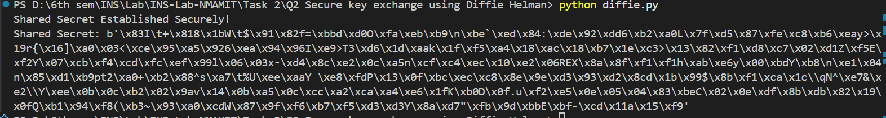

# Secure Key Exchange using Diffie-Hellman

## Overview

This implementation demonstrates secure symmetric key exchange using the Diffie-Hellman (DH) key exchange algorithm. It ensures that two parties can establish a shared secret securely without transmitting the actual key.

## Features

- Secure symmetric key exchange
- Key agreement between two parties
- 2048-bit key size for strong security
- Uses Python's `cryptography` library

## Requirements

```bash
pip install cryptography
```

## Implementation Details

### Components

1. **DH Parameter Generation**

   ```python
   from cryptography.hazmat.primitives.asymmetric import dh

   parameters = dh.generate_parameters(generator=2, key_size=2048)
   ```

2. **Private Key Generation for Two Parties**

   ```python
   private_key_A = parameters.generate_private_key()
   private_key_B = parameters.generate_private_key()
   ```

3. **Public Key Exchange**

   ```python
   public_key_A = private_key_A.public_key()
   public_key_B = private_key_B.public_key()
   ```

4. **Shared Secret Computation**

   ```python
   shared_secret_A = private_key_A.exchange(public_key_B)
   shared_secret_B = private_key_B.exchange(public_key_A)
   ```

5. **Verification of Key Agreement**
   ```python
   assert shared_secret_A == shared_secret_B  # Both parties should have the same key
   print("Shared Secret Established Securely!")
   ```

## Usage

```bash
python diffie_hellman.py
```

## Sample Output

```bash
Shared Secret Established Securely!
```

## Security Features

### 1. Strong Key Exchange

- Uses 2048-bit DH parameters
- Securely generates private keys
- Public keys exchanged over an unsecured channel

### 2. Key Agreement

- Both parties compute the same shared secret
- Prevents eavesdroppers from deriving the key

## Technical Details

### Key Properties

- **Algorithm**: Diffie-Hellman (DH)
- **Key Size**: 2048 bits
- **Security**: Provides forward secrecy

### Process Flow

1. Generate DH parameters
2. Generate private keys for both parties
3. Exchange public keys
4. Compute shared secret independently
5. Verify both parties establish the same key

## Best Practices

1. **Key Exchange Security**
   - Use authenticated channels to prevent man-in-the-middle attacks
   - Implement mutual authentication
2. **Key Usage**
   - Never reuse the shared secret directly
   - Derive session keys from the shared secret using a Key Derivation Function (KDF)

## Code Structure

```
diffie_hellman.py
├── DH Parameter Generation
│   └── generate_parameters()
├── Private Key Generation
│   ├── generate_private_key()
├── Public Key Exchange
│   ├── public_key()
├── Shared Secret Computation
│   ├── exchange()
└── Verification
```

## Limitations

- Demonstration implementation only
- No authentication mechanism included
- Public key exchange must be secured in real-world scenarios

## Security Considerations

- Implement authentication to prevent man-in-the-middle attacks
- Use additional encryption for public key transmission
- Apply key derivation techniques before using the shared secret

## Contributing

1. Fork the repository
2. Create a feature branch
3. Submit a pull request

## References

1. NIST SP 800-56A: Key Exchange Guidelines
2. Diffie-Hellman Key Exchange Specification
3. Python Cryptography Library Documentation

## License

MIT License

## Note

This implementation is for educational purposes. For production use:

- Implement authentication
- Secure public key transmission
- Use key derivation for secure key handling

## Screenshot of Implementation and Output


