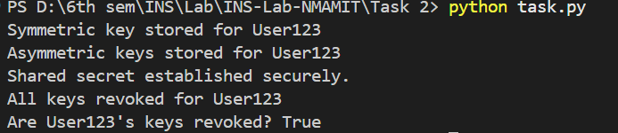

# Secure Key Management System

## Overview

This project implements a **secure key management system** supporting both **symmetric (AES-128) and asymmetric (RSA-2048) encryption**. Additionally, it includes **Diffie-Hellman key exchange** with signature authentication to prevent MITM attacks, **secure key storage**, and a **revocation system** for enhanced security.

## Features

- **Symmetric Key Management**

  - AES-128 encryption (via Fernet)
  - Key expiration mechanism
  - Secure key storage

- **Asymmetric Key Management**

  - RSA-2048 key pair generation
  - Private key encryption with password-based key derivation (PBKDF2HMAC)
  - Secure storage of encrypted private keys

- **Secure Key Exchange (Diffie-Hellman with Signatures)**

  - Diffie-Hellman key exchange for session key derivation
  - RSA-based signature authentication for public keys
  - HKDF-based key derivation for encryption

- **Key Revocation System**
  - Prevents revoked users from accessing new keys
  - Tracks revoked keys for additional security

## Requirements

Install the required dependencies using:

```bash
pip install cryptography
```

## Implementation Details

### 1. Symmetric Key Management

#### **Generate Symmetric Key**

```python
from cryptography.fernet import Fernet

def generate_symmetric_key():
    return Fernet.generate_key()
```

#### **Store Symmetric Key**

```python
import time

key_store = {}

def store_symmetric_key(user_id, key, expiry_time=3600):
    if user_id not in key_store:
        key_store[user_id] = {}
    key_store[user_id]['symmetric'] = {'key': key, 'expiry': time.time() + expiry_time}
```

### 2. Asymmetric Key Management (RSA)

#### **Generate RSA Key Pair**

```python
from cryptography.hazmat.primitives.asymmetric import rsa

def generate_asymmetric_keys():
    private_key = rsa.generate_private_key(public_exponent=65537, key_size=2048)
    public_key = private_key.public_key()
    return private_key, public_key
```

#### **Encrypt Private Key**

```python
import base64, os
from cryptography.hazmat.primitives.kdf.pbkdf2 import PBKDF2HMAC
from cryptography.hazmat.primitives import serialization, hashes

def encrypt_private_key(private_key, password):
    salt = os.urandom(16)
    kdf = PBKDF2HMAC(algorithm=hashes.SHA256(), length=32, salt=salt, iterations=100000)
    key = base64.urlsafe_b64encode(kdf.derive(password.encode()))

    encrypted_key = Fernet(key).encrypt(private_key.private_bytes(
        encoding=serialization.Encoding.PEM,
        format=serialization.PrivateFormat.PKCS8,
        encryption_algorithm=serialization.NoEncryption()
    ))
    return salt, encrypted_key
```

### 3. Secure Key Exchange (Diffie-Hellman with Signature Authentication)

#### **Generate DH Parameters & Compute Shared Secret**

```python
from cryptography.hazmat.primitives.asymmetric import dh

def generate_dh_parameters():
    return dh.generate_parameters(generator=2, key_size=2048)

def generate_dh_private_key(parameters):
    return parameters.generate_private_key()

def compute_shared_secret(private_key, peer_public_key):
    return private_key.exchange(peer_public_key)
```

#### **Sign and Verify Public Key (RSA Signature)**

```python
from cryptography.hazmat.primitives.asymmetric import padding

def sign_public_key(private_key, public_key_bytes):
    return private_key.sign(
        public_key_bytes,
        padding.PSS(mgf=padding.MGF1(hashes.SHA256()), salt_length=padding.PSS.MAX_LENGTH),
        hashes.SHA256()
    )

def verify_signature(public_key, public_key_bytes, signature):
    try:
        public_key.verify(
            signature, public_key_bytes,
            padding.PSS(mgf=padding.MGF1(hashes.SHA256()), salt_length=padding.PSS.MAX_LENGTH),
            hashes.SHA256()
        )
        return True
    except Exception:
        return False
```

### 4. Key Revocation System

#### **Revoke Key**

```python
revoked_keys = set()

def revoke_key(user_id):
    if user_id in key_store:
        revoked_keys.add(user_id)
        del key_store[user_id]
        print(f"All keys revoked for {user_id}")
```

#### **Check if Key is Revoked**

```python
def is_key_revoked(user_id):
    return user_id in revoked_keys
```

---

## Usage

Run the script to test the system:

```bash
python key_management.py
```

## Sample Output

```bash
Enter the user id: Alice
Enter the password: secret123

Symmetric key stored for Alice, expires in 3600 seconds
Asymmetric keys stored securely for Alice
Symmetric key generated and securely stored.
Symmetric key hash: 872387364
Public keys authenticated!
Secure symmetric key derived!
```

## Security Features

### 1. Key Generation

- **AES-128 encryption** for symmetric keys
- **RSA-2048** for asymmetric encryption
- **PBKDF2HMAC** for password-based key encryption
- **Diffie-Hellman key exchange** for secure session keys

### 2. Key Management

- User-specific **secure key storage**
- **Key expiration mechanism** to prevent unauthorized reuse
- **Revocation system** to block revoked users

## Code Structure

```
key_management.py
├── Symmetric Key Management
│   ├── generate_symmetric_key()
│   ├── store_symmetric_key()
├── Asymmetric Key Management
│   ├── generate_asymmetric_keys()
│   ├── encrypt_private_key()
│   ├── decrypt_private_key()
├── Secure Key Exchange (Diffie-Hellman)
│   ├── generate_dh_parameters()
│   ├── compute_shared_secret()
│   ├── sign_public_key()
│   ├── verify_signature()
├── Key Revocation System
│   ├── revoke_key()
│   ├── is_key_revoked()
└── Example Usage
```

## Limitations

- **In-memory key storage** (not persistent)
- **Basic error handling** (no logging)
- **No authentication mechanism for retrieving keys**

## Security Considerations

- **Use a secure database** for key storage
- **Implement authentication** for key retrieval
- **Secure communication (TLS/SSL)** for key exchange
- **Periodic key rotation** to enhance security

## Contributing

1. Fork the repository
2. Create a feature branch
3. Submit a pull request

## References

1. NIST SP 800-57: Key Management Guidelines
2. RSA Cryptography Standards
3. Python Cryptography Library Documentation

## License

MIT License

## Screenshot of Implementation and Output



### Google Colab Link of Ciphers

[](https://colab.research.google.com/drive/1CYtaclqqHLCiA61x5EFtN1qIryUDV6aZ)
