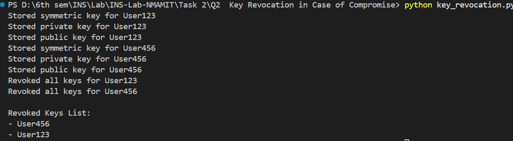

# Secure Key Management System

## Overview

This implementation demonstrates a secure key management system using both symmetric (AES-256 via Fernet) and asymmetric (RSA-2048) encryption methods. It includes key generation, storage, revocation, and status verification.

## Features

- Symmetric key generation (AES-256 using Fernet)
- Asymmetric key pair generation (RSA-2048)
- Secure key storage
- Key revocation and tracking

## Requirements

```bash
pip install cryptography
```

## Implementation Details

### Components

1. **Symmetric Key Generation**

   ```python
   from cryptography.fernet import Fernet
   def generate_symmetric_key():
       return Fernet.generate_key()
   ```

2. **Asymmetric Key Pair Generation**

   ```python
   from cryptography.hazmat.primitives.asymmetric import rsa
   def generate_asymmetric_keys():
       private_key = rsa.generate_private_key(
           public_exponent=65537,
           key_size=2048
       )
       public_key = private_key.public_key()
       return private_key, public_key
   ```

3. **Key Storage System**

   ```python
   key_store = {}  # Stores active keys
   revoked_keys = set()  # Stores revoked user IDs
   ```

4. **Key Storage Function**

   ```python
   def store_key(user_id, key_type, key):
       if user_id in revoked_keys:
           print(f"Cannot store key for {user_id}, as they are revoked.")
           return
       if user_id not in key_store:
           key_store[user_id] = {}
       key_store[user_id][key_type] = key
       print(f"Stored {key_type} key for {user_id}")
   ```

5. **Key Revocation**

   ```python
   def revoke_key(user_id):
       if user_id in key_store:
           revoked_keys.add(user_id)
           del key_store[user_id]
           print(f"Revoked all keys for {user_id}")
       else:
           print(f"No keys found for {user_id}")
   ```

6. **Checking Revoked Keys**

   ```python
   def is_key_revoked(user_id):
       return user_id in revoked_keys
   ```

7. **Displaying Revoked Keys**
   ```python
   def print_revoked_keys():
       if revoked_keys:
           print("\nRevoked Keys List:")
           for user in revoked_keys:
               print(f"- {user}")
       else:
           print("\nNo revoked keys found.")
   ```

## Usage

```bash
python key_management.py
```

## Sample Output

```bash
Stored symmetric key for User123
Stored private key for User123
Stored public key for User123
Revoked all keys for User123
Revoked Keys List:
- User123
```

## Security Features

### 1. Key Generation

- Uses cryptographically secure random number generators
- 256-bit AES for symmetric encryption
- 2048-bit RSA for asymmetric encryption

### 2. Key Management

- User-specific key storage
- Secure key revocation mechanism
- Prevents revoked users from accessing new keys

## Technical Details

### Key Properties

- **Symmetric Algorithm**: Fernet (AES-128-CBC + HMAC-SHA256)
- **Asymmetric Algorithm**: RSA (2048-bit key size)
- **Encoding**: Base64 encoding for Fernet keys

### Process Flow

1. Generate symmetric and asymmetric keys
2. Store the keys securely for each user
3. Revoke keys if necessary
4. Check and display revoked keys

## Best Practices

1. **Key Storage**
   - Use a secure database instead of in-memory storage
   - Encrypt stored keys at rest
   - Implement strict access controls
2. **Key Distribution**
   - Use secure channels for key distribution
   - Implement authentication for key retrieval
   - Add a key rotation mechanism

## Code Structure

```
key_management.py
├── Key Generation
│   ├── generate_symmetric_key()
│   └── generate_asymmetric_keys()
├── Key Storage
│   ├── store_key()
│   ├── revoke_key()
│   ├── is_key_revoked()
│   └── print_revoked_keys()
└── Example Usage
```

## Limitations

- Demonstration implementation only
- In-memory key storage (not persistent)
- Basic error handling
- No authentication mechanism

## Security Considerations

- Use a secure key storage system in production
- Implement error handling and logging
- Use TLS for secure communication
- Add authentication and access control
- Implement key rotation policies

## Contributing

1. Fork the repository
2. Create a feature branch
3. Submit a pull request

## References

1. NIST SP 800-57: Key Management Guidelines
2. RSA Cryptography Standards
3. Python Cryptography Library Documentation

## License

MIT License

## Note

This implementation is for educational purposes. For production use:

- Replace in-memory storage with a secure database
- Add proper error handling and authentication
- Use secure communication channels
- Implement key rotation and access controls

## Screenshot of Implementation and Output


